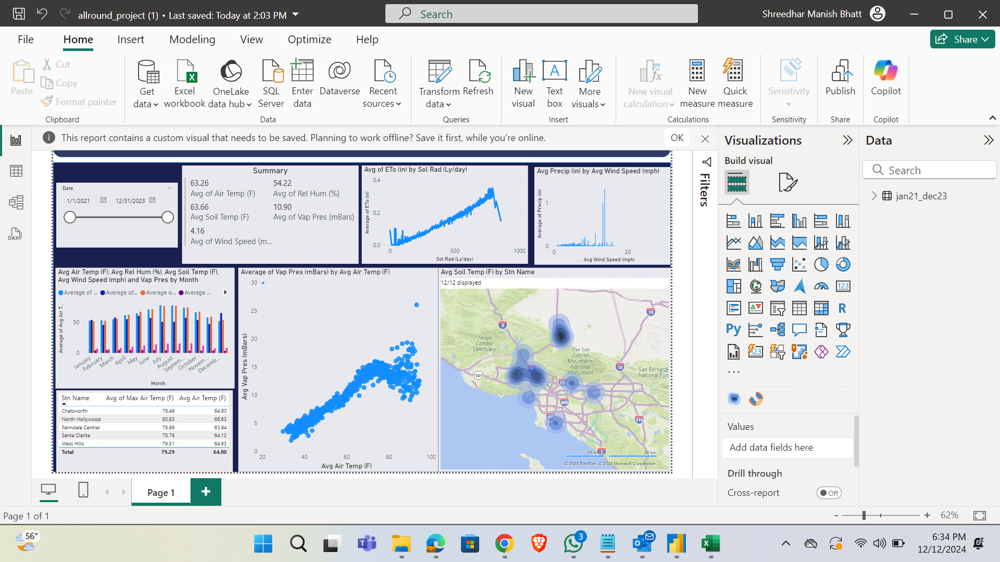
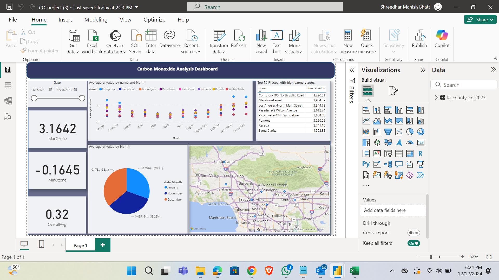
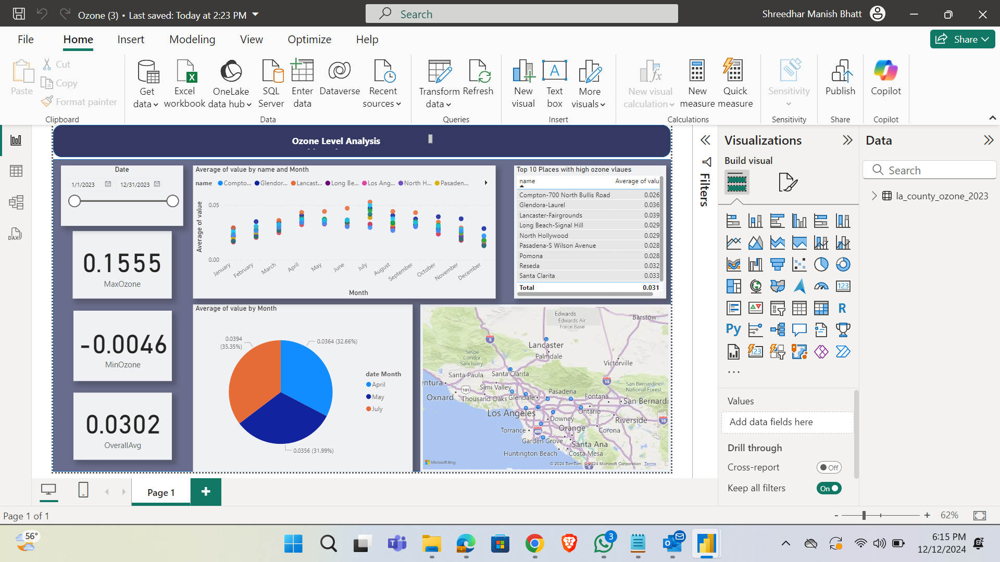

# Los-Angeles-Weather-Analysis

This project involves developing a series of Power BI dashboards for environmental data analysis, focusing on air quality parameters such as ozone levels and weather conditions in Los Angeles County. Key features include:

Dynamic Filters and Date Range Selection: Allows users to explore data trends over specific time periods.
Ozone Level Analysis: Visualizes monthly ozone trends, highlighting maximum, minimum, and average values for different regions.
Weather Correlation: Compares air temperature, soil temperature, wind speed, and vapor pressure against geographic and temporal data.
Top Locations by Ozone Levels: Displays the top 10 places with the highest ozone values for targeted analysis.
Interactive Geographic Mapping: Integrates a heatmap to pinpoint high ozone concentration areas on a map.
Summary Statistics: Provides average values for key environmental parameters.
Custom Visualizations: Incorporates bar charts, scatter plots, and pie charts for comparative insights.
Insightful Metrics: Highlights trends, correlations, and anomalies for better decision-making.
Focus on Environmental Health: Supports identifying areas requiring attention to improve air quality.
Scalable Dashboard Design: Designed for usability and scalability, catering to policymakers and researchers.
